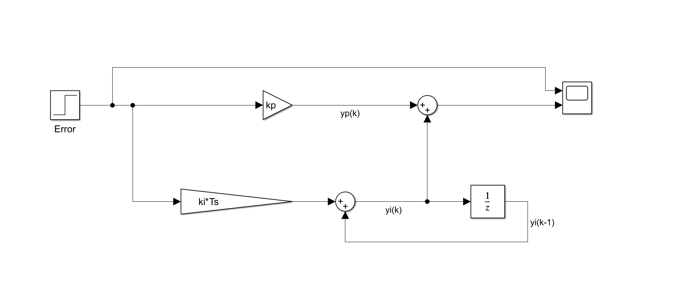

# PI Controller in Simulink 🎛️

This project implements a **Proportional-Integral (PI) controller** using MATLAB Simulink. PI controllers are widely used in **control systems, robotics, and automation** to regulate system performance.

## 📌 Features
✅ Digital PI control structure  
✅ Discrete-time integral action  
✅ Simple yet effective controller for various applications  

## 🖥️ Model Screenshot

## 📂 Files Included
- `Controller.slx` - Simulink model  
- `Controller.png` - Block diagram screenshot  
- `README.md` - Project documentation  

## 🚀 How to Use
1. Open `Controller.slx` in **MATLAB Simulink**.  
2. Modify `Kp`, `Ki`, and `Ts` for tuning.  
3. Run the simulation to observe the response.  

## 🤝 Contribute
Feel free to fork the project and enhance it!  

---
🔗 **Check out my GitHub for more projects!**  
